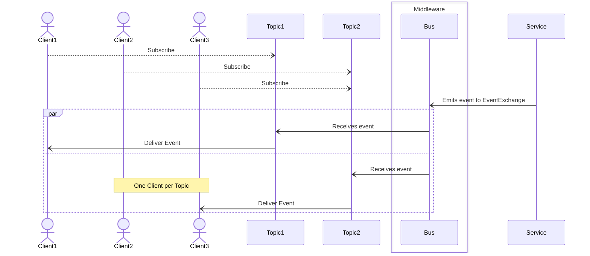

# Event

Events are emitted via the bus on the `eventExchangeName`. Not all services need to process every event. Servers that are type 'EventEmitters' will only emit events and not respond to messages.

## Process Diagram



## Structure

```javascript
{
  "type": "event"
  "route": "string"         // routing key to the event Emitter
  "instanceId": "string"    // instance id of event Emitter
  "event":  "string"        // event name
  "details": "string|json"  // details attributed to event
}
```
