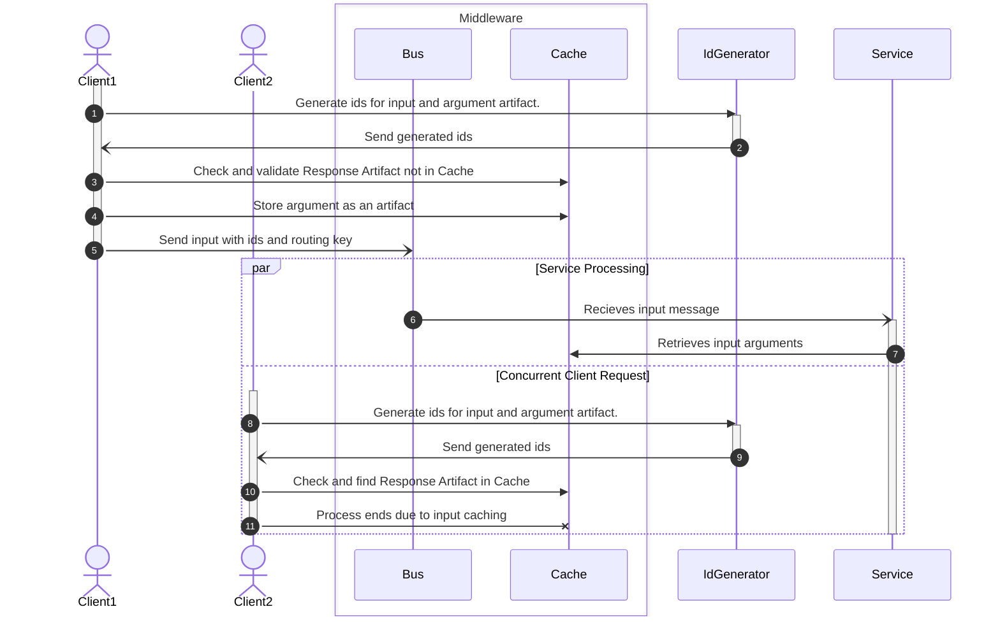

# Input Payload Structure

Input messages are communicated over the bus in the exchange `exchangeName`. Arguments to couple with the inputs are stored in the cache. This is to ensure that large messages are not sent over the bus because smaller messages travel faster. Ids can be generated to be utilized for caching. If the output to the `input.id` exists, then there is no need to send the message in the bus. This establishes a form of caching and invalidation. Specifying an instance id is able to narrow the processing to a specific service out of a collection matching to a routing key.

## Process Diagram

The `IdGenerator` generates the id based on the input and current state. Thus, the id is a function of state and input and performs passive cache invalidation.



## Input Structure

```javascript
{
  "type": "input"
  "id": "string"
  "route": "string"
  "argumentId": "string"
  "instanceId"?: "string"
}>
```

## Argument Artifact

The `argumentId` should reference a key in the cache storage layer with a value following the following structure

```
{
  "method": "string",
  "inputs": "any"
}
```
