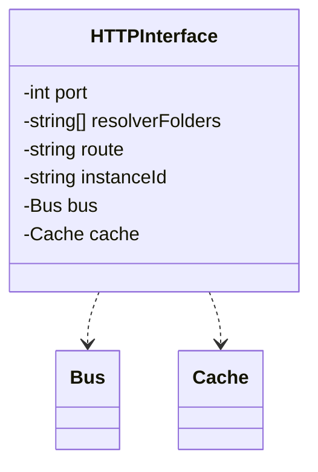

# Interfaces

The interface allows all services to act as an API layer because it can route to the appropriate location utilizing the bus layer.

## HTTP Interface

The following routes are reserved and should be implemented to respond to the following requests,

```
GET  /health      // respond 200 if okay, 500 if not
GET  /ready       // respond 200 if ready, 500 if not
POST /            // send a message on the bus
GET  /id/:id      // get value of id in cache.
                     a null value means it does not exist.
```

Where `POST /` takes the same format as [input](./input.md), however `argumentId` will be an object and `id` will not be required. Instead, `argument` will be required and will take the format as the argument artifact.

## Class Diagram



The interface will not only handle the web requests, it will spin up the bus and start listening for changes.
