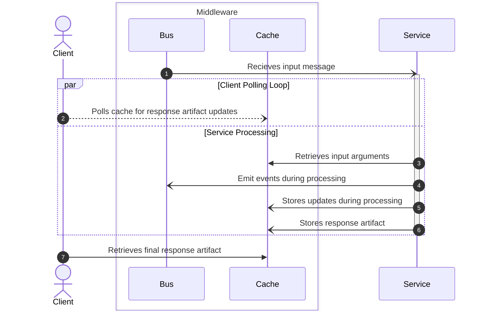

# Response Structure

The response structure is specifically nonblocking in order to ensure maximum concurrency and throughput. The flow of data should always be one-direction with no blocking or polling in the service layers. All polling should be managed on the client side and the service should have no management of state in relationship to the input flow.

## Process Flow Diagram



## Response Structure

```javascript
{
  "id": "string",
  "progress": "float",
  "statusCode": "int",
  "responseBody": "string|json obj",
  "isError": "boolean"
}
```

Where progress is always greatner than or equal to zero and less than or equal to 1.

## Status Codes

- 200: Okay
- 400: Bad Request. Invalid input
- 500: Server error.

The current state of processing can be determined based on the response structure and the status code.

**Not Started or Not Sent**

```javascript
{
  progress: 0;
  isError: false;
  statusCode: 200;
  responseBody: string;
}
```

**In Progress**

```javascript
{
  progress: >0, <1;
  isError: false;
  statusCode: 200;
  responseBody: string;
}
```

**Finished**

```javascript
{
  progress: 1;
  isError: false;
  statusCode: 200;
  responseBody: string | object;
}
```

**Error**

```javascript
{
  progress: 1,
  isError: true,
  statusCode: >= 400
  responseBody: string
}
```
