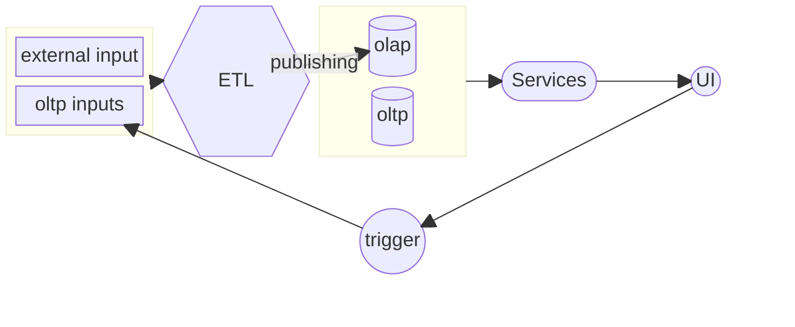

# Serv-c

Serv-c is an opinionated framework and prescribes a pattern for cloud-native technologies. Serv-c spans data engineering, modeling, services, database schemas, and front-end technologies. Serv-c specializes in dimensionalized data and assumes that all data can be a set of dimensions and observations measured at the intersection of dimensions.

## Segments

Frontend

Services

Database

Data Engineering

## Process Flow

A trigger can either be batch, continuous, or both. The OLTP is updated with user inputs and can be combined with the OLAP to make a single view. Data can be generated or appended to the OLAP to provide a consistent UI. The OLAP is preferred for outputs of the ETL because it is faster than the OLTP and segregates User input (OLTP) from Process outputs (OLAP).
