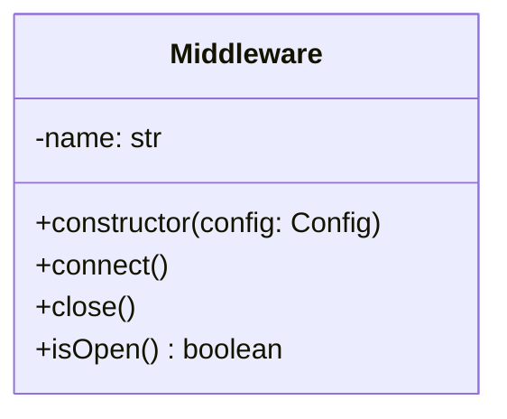
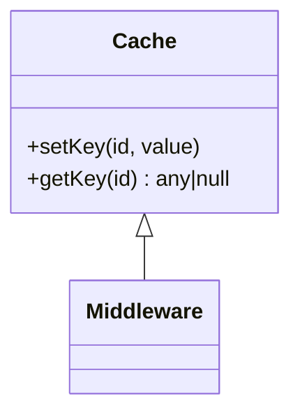
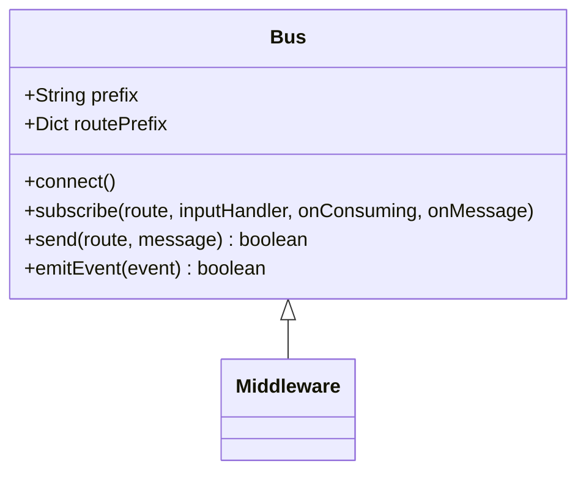

# Middleware

All [middleware](../schema/middleware.schema.json) should have the following interface.

Where [config](./config/index.md) is a key:value pair dictionary that is scoped to the middleware by its `name` property. So if the name property is 'bus', the config object will be scoped to `config.bus`.

## Cache

The cache class is a type of component with the following interface,

### config

The configuration parameters for the default cache middleware should be the connection url.

Parameters:

| name     | type | description                                                                                                 |
| -------- | ---- | ----------------------------------------------------------------------------------------------------------- |
| conn_url | str  | a string with the connection url to the middleware. Defaults to the configuration variable `conf.cache.url` |

### setKey(id, value)

Parameters:

| name  | type | description                                           |
| ----- | ---- | ----------------------------------------------------- |
| id    | str  | the key in the middleware to set                      |
| value | any  | the value to store in the middleware at location `id` |

### getKey(id)

gets the value of a key from the cache middleware

Parameters:

| name | type | description                                        |
| ---- | ---- | -------------------------------------------------- |
| id   | str  | the key to retrieve its value from the middleware. |

Returns:

Either the value in the middleware, or `null` if it does not exist in the middleware.

## Bus

### config

Parameters:

| name     | type | description                                                                |
| -------- | ---- | -------------------------------------------------------------------------- |
| conn_url | str  | The url to connect to the bus. defaults to `conf.bus.url`                  |
| prefix   | str  | The prefix to use when setting up the route. Defaults to `conf.bus.prefix` |

### subscribe(route, inputHandler, onConsuming, onMessage)

Parameters:

| name         | type         | description                                           |
| ------------ | ------------ | ----------------------------------------------------- |
| route        | str          | the route to subscribe to                             |
| inputHandler | [INPUTHANDLER](./schema/middleware-bus-inputhandler.schema.json) | a function to handle messages routed to the service   |
| onConsuming  | [ONCONSUMING](./schema/middleware-bus-onconsuming.schema.json)  | a call back function when the service is consuming    |

### send(route, message)

Parameters:

| name         | type         | description                                           |
| ------------ | ------------ | ----------------------------------------------------- |
| route        | str          | the route to subscribe to                             |
| message | [Payload](./schema/payload.schema.json) | a function to handle messages routed to the service   |

Returns:

Boolean true if successful.

### emitEvent(event)

Parameters:

| name         | type         | description                                           |
| ------------ | ------------ | ----------------------------------------------------- |
| event        | [Event](./schema/event.schema.json)          | the event to emit                          |

Returns:

Boolean true if successful.