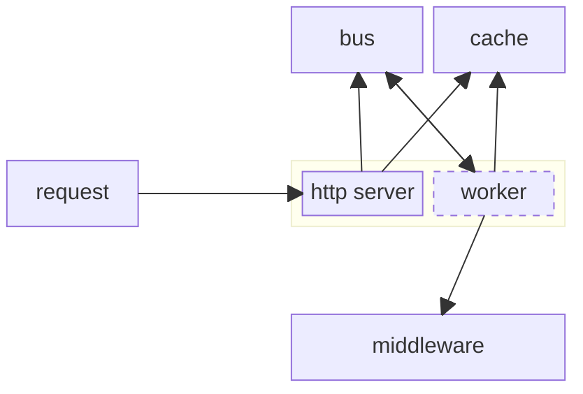
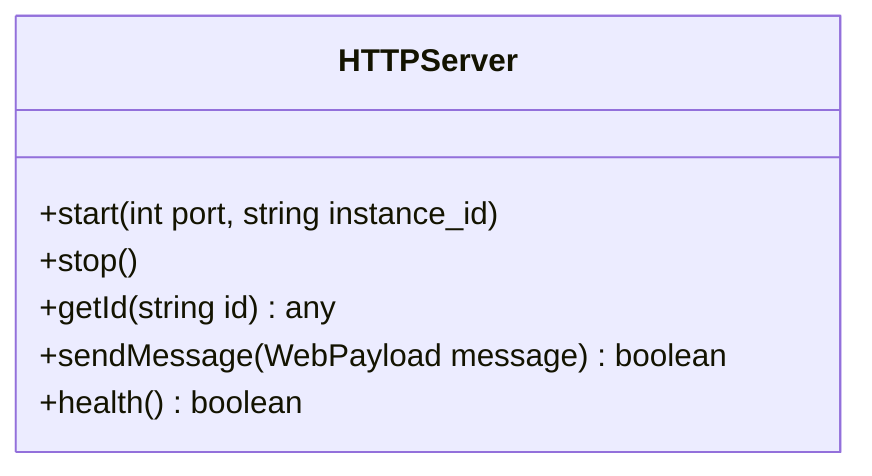

# Services

The microservice layer responds to requests in a nonblocking manner to the client.



A microservice will always have an HTTP server and optionally a worker.

## HTTP Server

The HTTP server will receive and be responsible for:

- **health checks**: to ensure the service is healthy
- **messaging**: sending messages along the bus for services to perform work
- **responses**: checking the cache for the response from the worker
- **spawn**: spawns the worker process and observes the health of the worker process

The HTTP server is the observer to the worker and health checks should fail if the worker is not running or unhealthy. The following interface should be implemented,



The server will respond to the following http interface,

```
GET /healthz
GET /readyz
      200   OK
      >400  not okay

GET /id/:id
    200   responds with the value of id in cache
    404   value does not exist in cache
    >500  issue accessing id in cache

GET /
    200   responds with microservice information

POST /
    200   message sent along bus
    500   issue sending message to bus
```

The format for the microservice information will follow the [identification schema](../schema/identification.schema.json).

## [Worker](./worker/)

The worker code should be specific to its function and maintain a connection with the bus and subscribe to a topic or queue. The subscription will allow the bus to send tasks to the service to process and complete. Middleware may need to maintain an open connection or establish as necessary.
