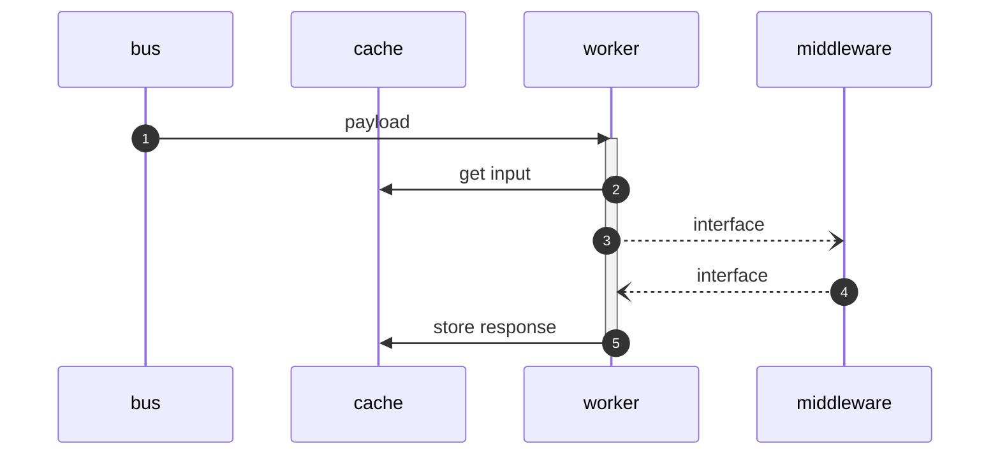
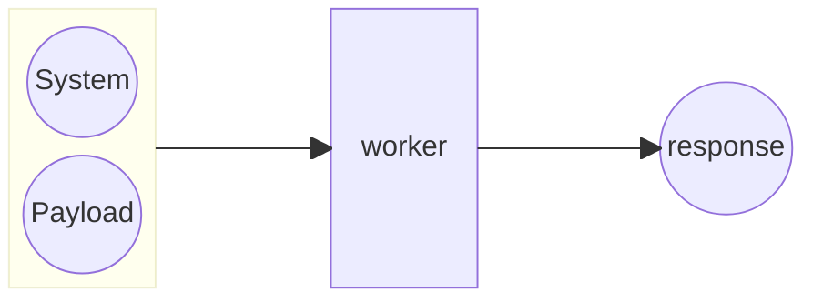

# Worker

The worker will process payloads as indicated below,

1. retrieve the [payload](../schema/payload.schema.json) from the bus on the queue/topic that the worker has subscribed to.
2. retrieve the [arguments object](../schema/argument.schema.json) from the cache at key `arugmentId`
3. perform work while storing progress in the cache at location `id` as an [artifact response](../schema/response.schema.json). Microservices will leverage the middleware as needed to perform work
4. store the solution/response at location `id` in cache.

`id` is an optional string that represents the arguments object and the state of the system.

If the state of the system and the payload is the same, then the reponse should be the same and thus the message will not be sent over the bus. The `force` parameter when true will ensure that the message is sent on the bus regardless if there is a completed response in the cache or not.
