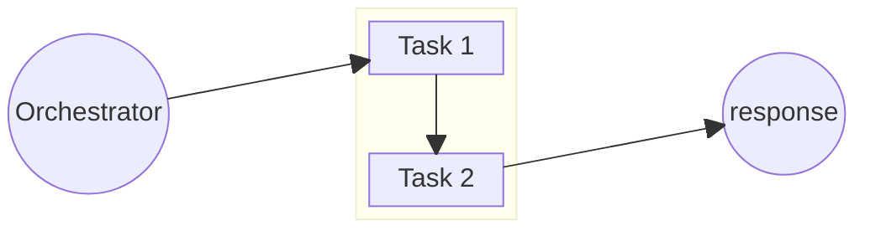
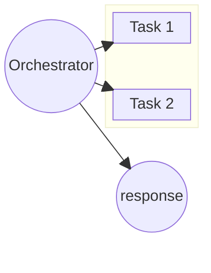

# On Complete

```json
"oncomplete": [
    { ... }
]
```

The [on complete](../../../schema/worker-hooks-oncomplete.schema.json) hook runs a series of tasks after a job has completed successfully or not. The order of execution is based on the order as presented in the array. Thus, if the first hook fails to execute, subsequent hooks will fail. No event is thrown if the hook fails to execute.

On complete hooks are obsecure to the program executing them, and fully co-ordinated by the program sending the payload. Orchestrators can make full use of this in order to perform a workflow of tasks.



We want to avoid having the individual tasks to know their location relative to the other tasks and leverage an orchestrator to delegate and report on the status of the pipeline. Leveraging "on complete" hooks we can achieve this.



## Send Message Hook

To use the send message hook, the oncomplete must be specified as below,

```json
{
    "type": "sendmessage",
    "route": "my-route", // the route to send to upon completion
    "method": "my method", // the method to send the below payload
}
```

The schema for the payload is [argument schema](../../../schema/argument.schema.json) with the id of where the response is stored.

```json
{
    ...argument,
    "id": ""
}
```