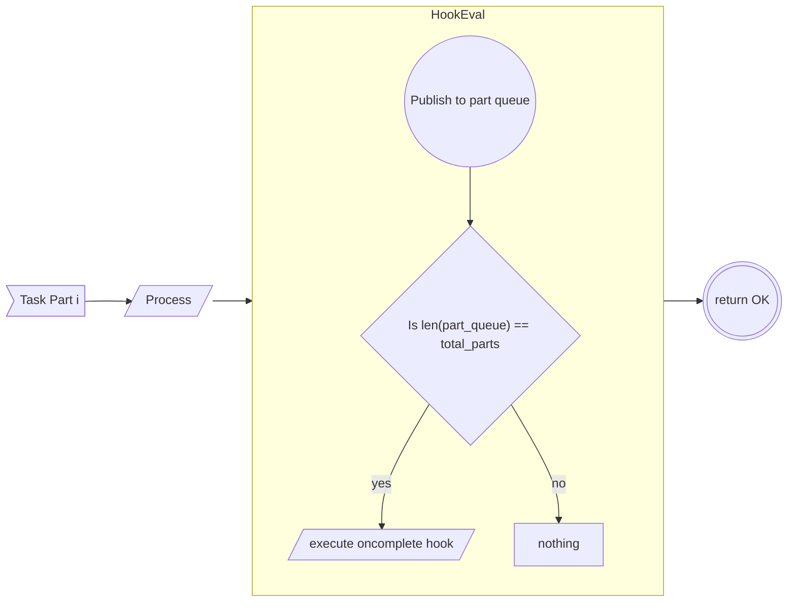
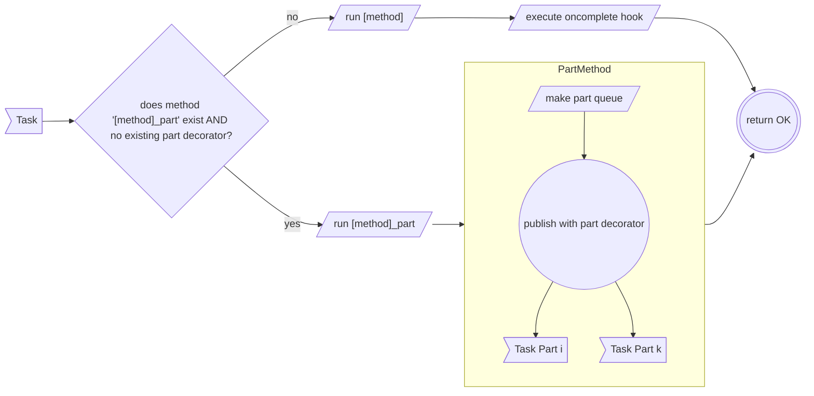

# Parallelize

```json
"part": {
    "part_id": "number",
    "total_parts": "number",
    "part_queue": "string"
}
```

The [part](../.././../schema/worker-hooks-oncomplete.schema.json) hook identifies if there are multiple tasks running in parrallel that must be completed before continuing. Having a `part` hook decorator will block the [oncomplete](./oncomplete.md) hook until all the parts are complete. The `part_queue` should be unique as to not conflict with other routes in the exchange. Example: `part.<svc>-<method>-<id>`

**Note:** The maximum length of a queue in AMQP is usually 255 bytes.

The part hook is to obsecure from the client how the program is internally solving a payload. This allows the solution to be program dependent. The workflow of when a part hook is identified should be as follows,



## Creating the Decorator

The decorator can be manually added or also generated by the service itself

### Generation

If the method being triggered has a method with the suffix `_part`, the [worker](../../worker/index.md) should follow the following flow to generate part decorators. When using the generator, the other hooks are ignored.



## Use Case

A task can be split into smaller tasks in order to streamline workloads or deal with larger workloads in a horizontal approach. The system needs to keep track of all the splits in order to know when the [oncomplete](./oncomplete.md) hook should be executed if needed.