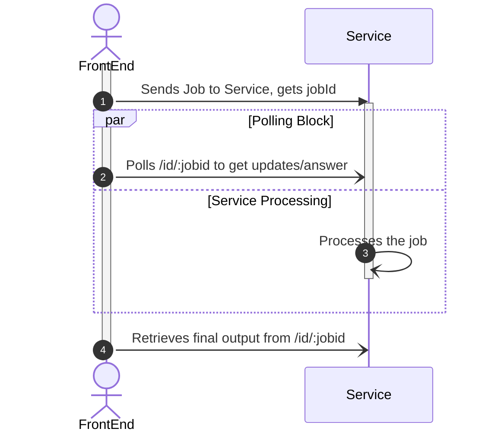

# Client

The client interacts with the [interface](../../conventions/specification/interface.md) of all services. The services can route the requests and thus any service can be used as a gateway to the full collection of microservices.

Each request is considered a job and includes a polling block that delivers dynamic progress updates. Jobs can be grouped to form an aggregate job that will deliver a single response object.

## Process Flow



## Bulk Job Structure

The bulk job input will be in the following format,

```javascript
{
  [key: string]: JOB
}
```

where key cannot be any of the keys in the [response artifact](../../conventions/specification/response.md). the key can only contain lowercase a-z characters.

The bulk response will be in the same format as the response artifact except the response body will be following format

```javascript
{
  [key: string]: JOB["responseBody"]
}
```

## Bulk Job Processing

All bulk job handling is frontend/client side. The service layer has no opionion or notion of bulk jobs.

1. Send list of job requests to service and get job ids.
2. Create an aggregate id using the following convention, `{key1}:{jobid1}_{key2}:{jobid2}`. Thus, the aggregate id retains the list of jobs that constitute the bulk job and the associated key to produce the response artifact.
3. Perform aggregation of other fields using following rules:
   1. Progress: average of all progress
   2. isError: use bool_or approach
   3. statusCode: highest number is the resulting statusCode
