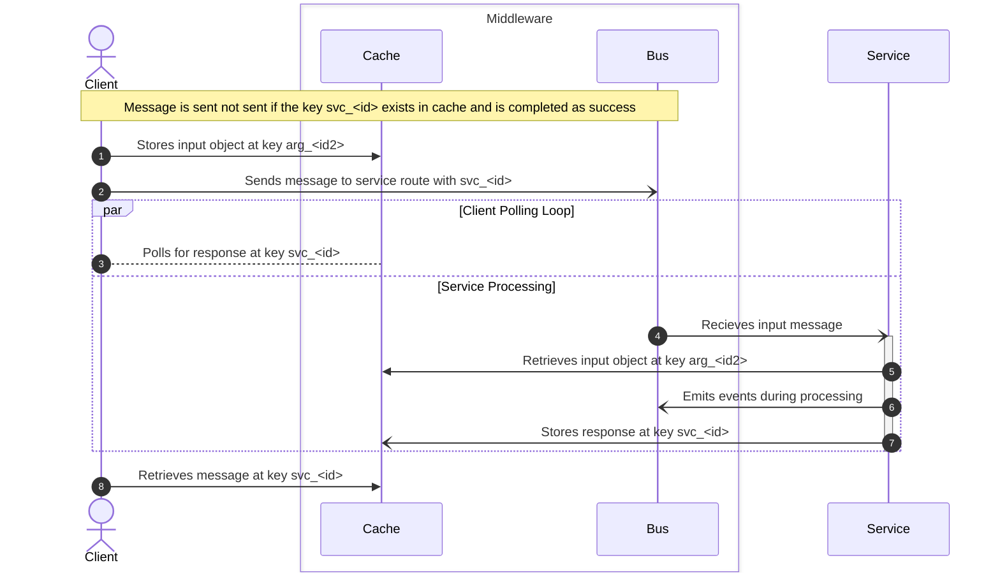

# Services Specification

## Process Diagram

```mermaid
sequenceDiagram
  autonumber
  actor Client
  box Middleware
  participant Cache
  participant Bus
  end
  participant Service

  Note over Client,Bus: Message is sent not sent if the key svc_<id> exists in cache and is completed as success
  Client->>Cache: Stores input object at key arg_<id2>
  Client-)Bus: Sends message to service route with svc_<id>
  par Client Polling Loop
    Client-->Cache: Polls for response at key svc_<id>
  and Service Processing
    Bus-)Service: Recieves input message
    activate Service
    Service->>Cache: Retrieves input object at key arg_<id2>
    Service-)Bus: Emits events during processing
    Service-)Cache: Stores response at key svc_<id>
  end
  deactivate Service
  Client->>Cache: Retrieves message at key svc_<id>
```
