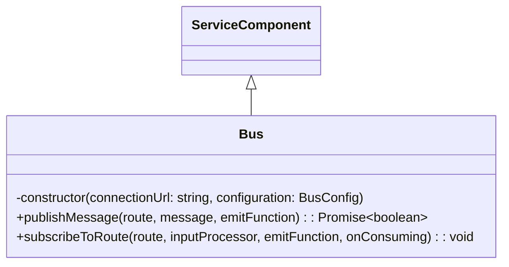

# Bus Component

The goal of the bus is simply to send messages and subscribe to topics.

## Methods and Attributes

### publishMessage(route, message, emitFunction)

- **route** - the routing key to send. This will be prefixed
- **message** - the message to send. if the type is event, it will publish to the event exchange. Otherwise, it will publish to the default exchange.
- **emitFunction** - Callback function that is triggered when the message is emitted. The first argument is the message, the second argument is the route. Subsequent arguments are implementation specific.

### subscribeToRoute(route, inputProcessor, emitFunction, onConsuming)

- **route** - the routing key to send. This will be prefixed
- **inputProcessor** - the method used to process messages upon arrival. The first argument is the message. The second argument will be the route that is currently being subscribed on. The message will be either an input or event. Subsequent arguments are implementation specific. The response will be a promise that resolves to a StatusCode.
- **emitFunction** - Callback function that is triggered when the message is emitted. The first argument is the message, the second argument is the route. Subsequent arguments are implementation specific.
- **onConsuming** - Callback function that is triggered when server begins consuming. The first argument route. Subsequent arguments are implementation specific.
