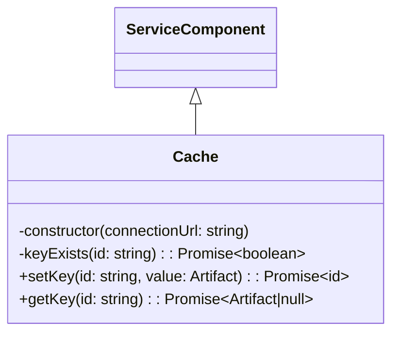

# Cache Component

The goal of the cache is simply to get and set key value pairs.

## Methods and Attributes

### keyExists(id: string)

returns true if the id exists in the cache

### setKey(id: string, value: Artifact)

will store any serializable object in the cache. Currenly should only accept a argument artifact or a response artifact.
