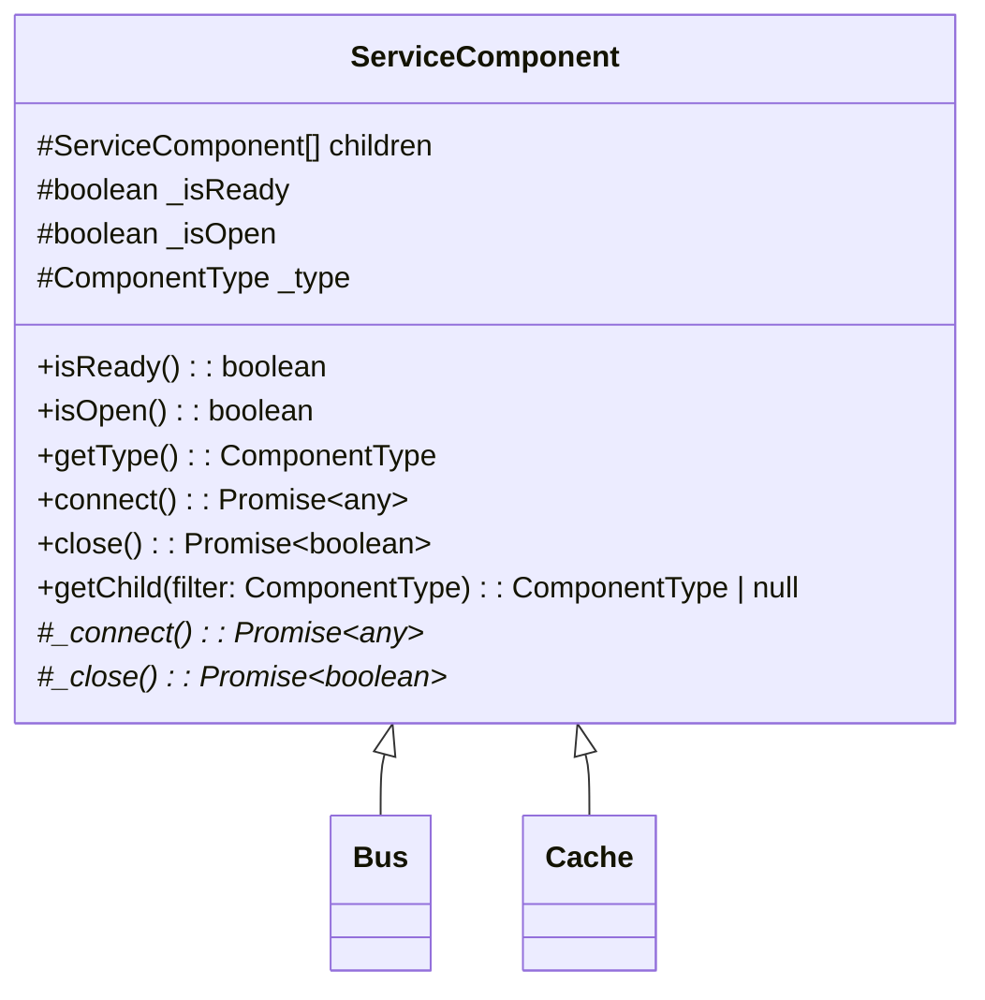

# Service Component and Middlewares

```mermaid
classDiagram
  ServiceComponent <|-- Bus
  ServiceComponent <|-- Cache

  class ServiceComponent {
    #ServiceComponent[] children
    #boolean _isReady
    #boolean _isOpen
    #ComponentType _type

    +isReady(): boolean
    +isOpen(): boolean
    +getType(): ComponentType
    +connect(): Promise~any~
    +close(): Promise~boolean~
    +getChild(filter: ComponentType): ComponentType | null

    #_connect(): Promise~any~*
    #_close(): Promise~boolean~*
  }

  class Bus {

  }

  class Cache {

  }

```
