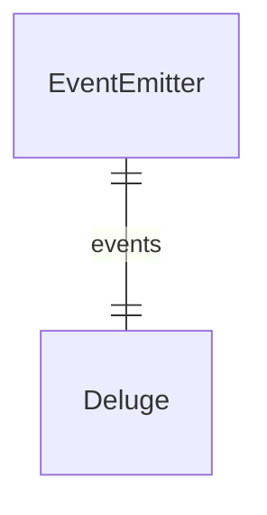

# Service Types

## Service (svc)

The service will handle both input and event resolvers. Services can also emit events. Services are not expected to be always running and can scale to zero.

## Event Emitter (evnt)

The service will handle only event resolvers. Services are primarily used to emit events when attached to another external service/component. Always will be one-to-one relationship. Example: Deluge

A more detailed specification for event emitters will be outlined as its own section.
